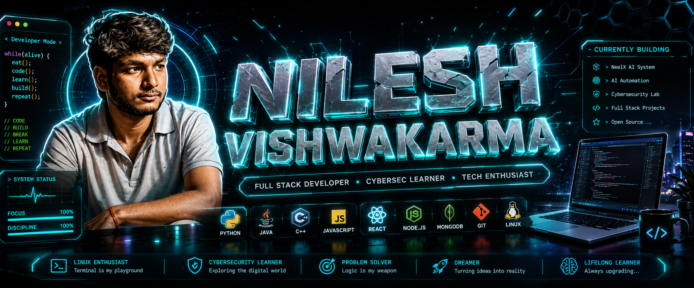

<!-- ========================================================= -->
<!--                 NILESH VISHWAKARMA                       -->
<!--              3D CYBER DEVELOPER README                  -->
<!-- ========================================================= -->

<!-- ========================= HERO ========================== -->

  

 

  

  

  

  

  

---

<!-- ========================= ABOUT ========================= -->

<h2 align="center">⚡ WHO AM I?</h2>

  <b>Developer • Engineer • Open Source Contributor • Cybersecurity Learner</b>

  I build real-world software, explore AI systems,
  experiment with Linux and cybersecurity,
  and contribute to open-source projects.

 

<table align="center">
  <tr>

    <td align="center" width="25%">
      <h3>💻</h3>
      <b>BUILDING</b>
        
      Full Stack
       
      Applications
    </td>

    <td align="center" width="25%">
      <h3>🧠</h3>
      <b>EXPLORING</b>
        
      AI
       
      Automation
    </td>

    <td align="center" width="25%">
      <h3>🛡️</h3>
      <b>LEARNING</b>
        
      Cybersecurity
       
      Linux
    </td>

    <td align="center" width="25%">
      <h3>🚀</h3>
      <b>CREATING</b>
        
      Real World
       
      Solutions
    </td>

  </tr>
</table>

---

<!-- ====================== TECH ARSENAL ===================== -->

<h2 align="center">🧠 TECH ARSENAL</h2>

  

 

<table align="center">
  <tr>
    <td align="center">🐍 <b>Python</b></td>
    <td align="center">☕ <b>Java</b></td>
    <td align="center">⚛️ <b>React</b></td>
    <td align="center">🟢 <b>Node.js</b></td>
  </tr>

  <tr>
    <td align="center">🗄️ <b>MySQL</b></td>
    <td align="center">🍃 <b>MongoDB</b></td>
    <td align="center">🐧 <b>Linux</b></td>
    <td align="center">🔧 <b>Git</b></td>
  </tr>
</table>

---

<!-- ======================== PROJECTS ======================= -->

<h2 align="center">🚀 FEATURED PROJECTS</h2>

<table align="center">

  <tr>

    <td width="50%" valign="top">

      <h3>👁️ Omni-Eye</h3>

      Real-time AI surveillance system focused on
      computer vision and face recognition.

        

      <b>Technology</b>

        

      <code>Python</code>
      <code>Flask</code>
      <code>OpenCV</code>
      <code>SQL</code>

    </td>

    <td width="50%" valign="top">

      <h3>🛰️ STDAMS</h3>

      Satellite monitoring and anomaly detection
      system using machine learning and data analysis.

        

      <b>Technology</b>

        

      <code>Python</code>
      <code>Machine Learning</code>
      <code>Scikit-Learn</code>
      <code>DataViz</code>

    </td>

  </tr>

  <tr>

    <td width="50%" valign="top">

      <h3>🧠 NeelX</h3>

      AI-powered automation and vision system designed
      to interact with devices and execute intelligent actions.

        

      <b>Technology</b>

        

      <code>Python</code>
      <code>AI</code>
      <code>Computer Vision</code>
      <code>Automation</code>

    </td>

    <td width="50%" valign="top">

      <h3>🍏 Open Food Facts</h3>

      Open-source contribution involving UI,
      backend improvements and documentation.

        

      <b>Technology</b>

        

      <code>JavaScript</code>
      <code>Python</code>
      <code>C++</code>
      <code>Documentation</code>

    </td>

  </tr>

</table>

---

<!-- ==================== CYBERSECURITY ======================= -->

<h2 align="center">🛡️ CYBERSECURITY LAB</h2>

  

  

  

  

  🔍 Networking
  &nbsp; • &nbsp;
  🐧 Linux
  &nbsp; • &nbsp;
  🛰️ Reconnaissance
  &nbsp; • &nbsp;
  💻 Bash
  &nbsp; • &nbsp;
  🔐 Security Fundamentals

---

<!-- ==================== GITHUB ANALYTICS ==================== -->

<h2 align="center">📊 GITHUB ANALYTICS</h2>

  

  

 

  

---

<!-- ================= CONTRIBUTION SNAKE ==================== -->

<h2 align="center">🐍 CONTRIBUTION MATRIX</h2>

  <picture>

    <source
      media="(prefers-color-scheme: dark)"
      srcset="https://raw.githubusercontent.com/nileshvishwakarma2004/nileshvishwakarma2004/output/github-snake-dark.svg"
    />

    <source
      media="(prefers-color-scheme: light)"
      srcset="https://raw.githubusercontent.com/nileshvishwakarma2004/nileshvishwakarma2004/output/github-snake.svg"
    />

    

  </picture>

---

<!-- ================= CURRENTLY WORKING ===================== -->

<h2 align="center">⚙️ CURRENTLY WORKING ON</h2>

<table align="center">

  <tr>
    <td>
      🔭 Building <b>NeelX AI Automation System</b>
    </td>
  </tr>

  <tr>
    <td>
      🌱 Learning <b>Cybersecurity + AI Systems</b>
    </td>
  </tr>

  <tr>
    <td>
      💻 Improving <b>Full Stack Development</b>
    </td>
  </tr>

  <tr>
    <td>
      🤝 Contributing to <b>Open Source</b>
    </td>
  </tr>

  <tr>
    <td>
      🚀 Turning Ideas Into <b>Real Projects</b>
    </td>
  </tr>

</table>

---

<!-- ===================== CONNECT ============================ -->

<h2 align="center">🌐 CONNECT WITH ME</h2>

  

  

  

---

<!-- ======================== FOOTER ========================= -->

  <b>CODE → BUILD → BREAK → LEARN → REPEAT</b>

 

  

